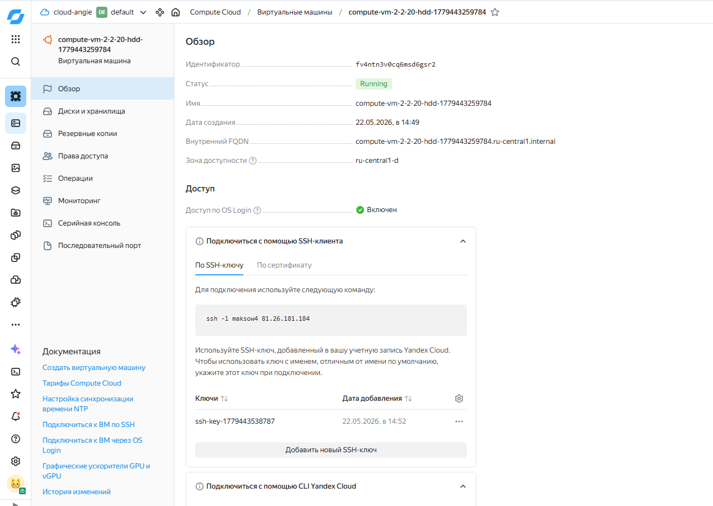
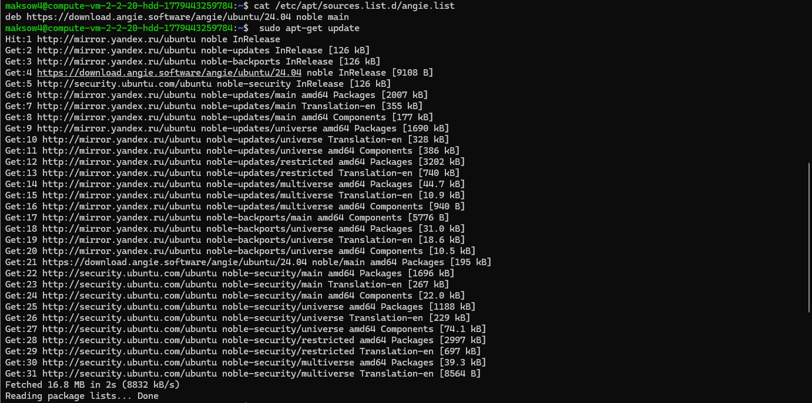
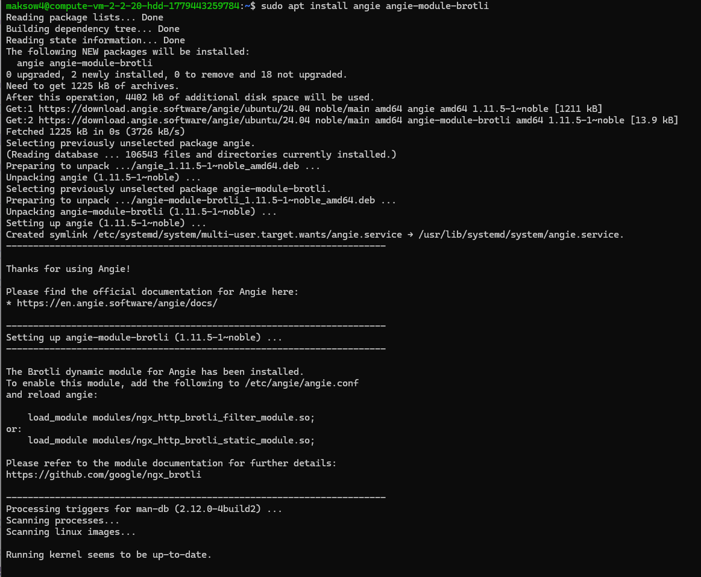
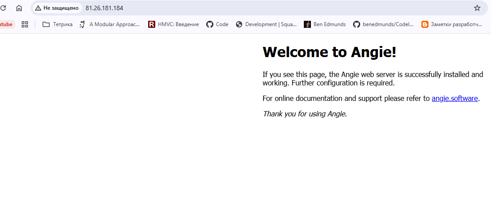
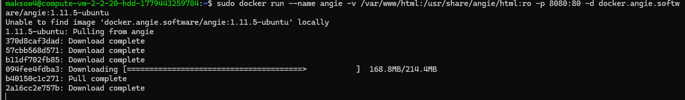
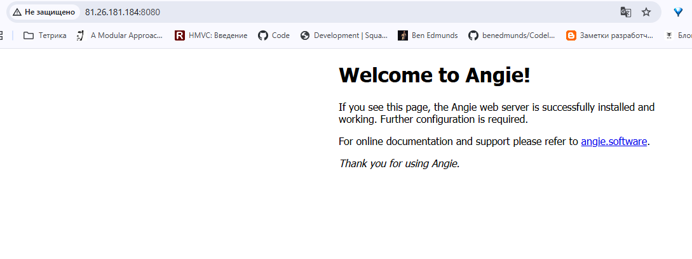

## Домашее задание № 1 Установка Angie

### Занятие 1. Варианты установки Angie // ДЗ

#### Цель

- провести установку актуальной версии Angie на виртуальную машину различными способами

#### Описание домашнего задания

Инструкция:
Подключите в систему (Яндекс.Облако или локальную ВМ) официальный репозиторий Angie.
Установите Angie и несколько дополнительных (на выбор) модулей из репозитория.
Запустите Angie из Docker-образа. Необходимо вынести конфигурацию в хостовую директорию и указать проброс портов в хостовую сеть для HTTP/HTTPS.

#### Ход работы

1. Создание ВМ в Яндекс.Облако и подключение



2. Подключение репозитория Angie и установка





3. Результат 



4. Установка Докер и запуск контейнера с Angie на порту 8080



5. Копирование папки конфигурации на хост

```
sudo docker cp angie:/etc/angie/ /home/db/angie
```

6. Запуск контейнера

Контейнер запущен в докер на 8080 порту




#### Результат

Angie успешно установлен и запущен в хостовой и докер установках.