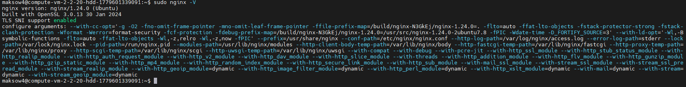
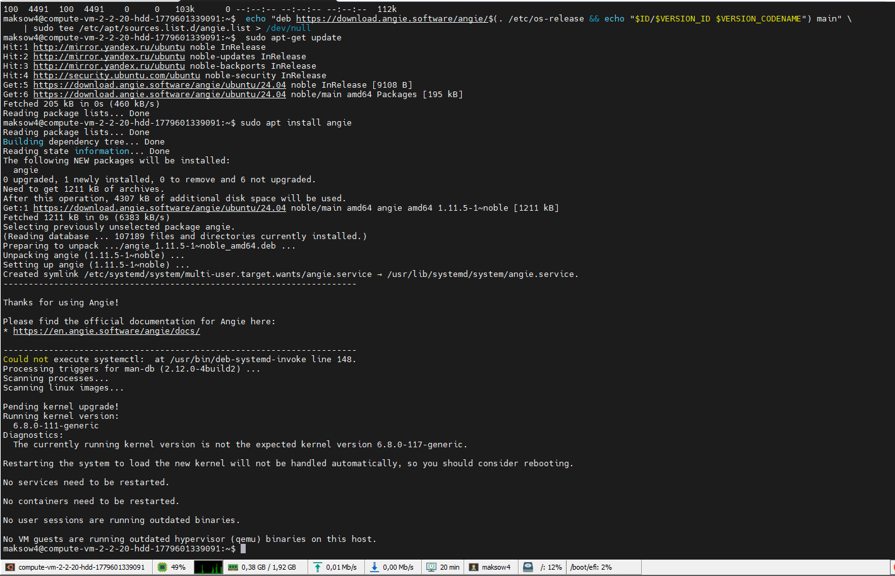
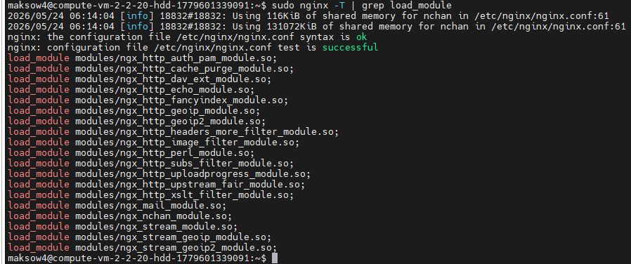
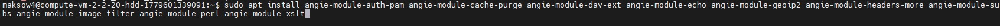
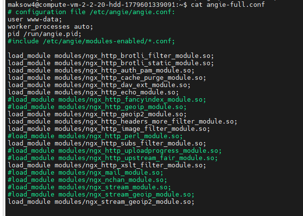
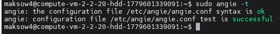
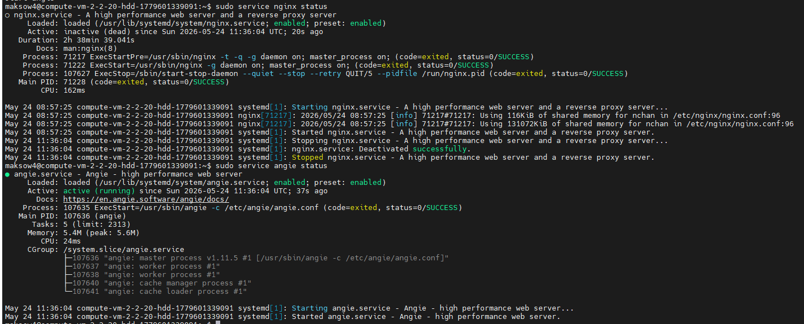

## Домашее задание № 2 Миграция из Nginx в Angie

### Занятие 4. Миграция с Nginx на Angie // ДЗ

#### Цель

- научиться переводить готовые конфигурации для Nginx в конфигурацию Angie.

#### Описание домашнего задания

Инструкция:

Возьмите готовый набор конфигов для Nginx, вы найдёте его в дополнительных материалах к занятию.
Установите рядом Angie.
Перенесите все значимые параметры конфигурации из Nginx в Angie.
*Дополнительно: автоматизируйте преобразование конфигов с помощью bash или другого скриптового языка.

#### Ход работы

1. Развернули ВМ с nginx и предоставленной конфигурацией

В конфигурации используется модуль brotli. В связи с этим дполнительно усановлен данный модуль.



2. Ставим Angie на хост уже известным нам способом



3. Сбор информации о конфигурации nginx

Мной был поставлен пакет nginx-extras. 
Собираем информацию о подключенных модулях nginx



4. Устанавливаем недостающие модули Angie



5. Переносим конфигурацию nginx в папку конфигурации angie

Подключаем модули.



Меняем в конфигурационных файлах упоминания /nginx на /angie

```
# Поиск путей
grep -rn '/nginx' /etc/angie
# Замена в конфигах
find . -type f -name '*.conf' -exec sed --follow-symlinks -i 's|/nginx|/angie|g' {} \;
grep -lr -e 'nginx' . | xargs sed -i 's/nginx/angie/g'
```

Меняем символические ссылки в папке /etc/angie/sites-enabled/ на /etc/angie/sites-available

```
# Работа с символическими ссылками sites-enabled
find /etc/angie/sites-enabled/* -type l -printf 'ln -nsf "$(readlink "%p" | sed s!/etc/nginx/sites-available!/etc/angie/sites-available!)" "$(echo "%p" | sed s!/etc/nginx/sites-available!/etc/angie/sites-available!)"\n' > script.sh
chmod +x script.sh
./script.sh
```

6. Проверяем конфигурацию Angie



Полная конфигурация angie представлена в файле angie-full.conf

7. Переключаемся на Angie

```
sudo systemctl stop nginx && sudo systemctl start angie
```




#### Результат

Провели работы по миграции nginx на angie