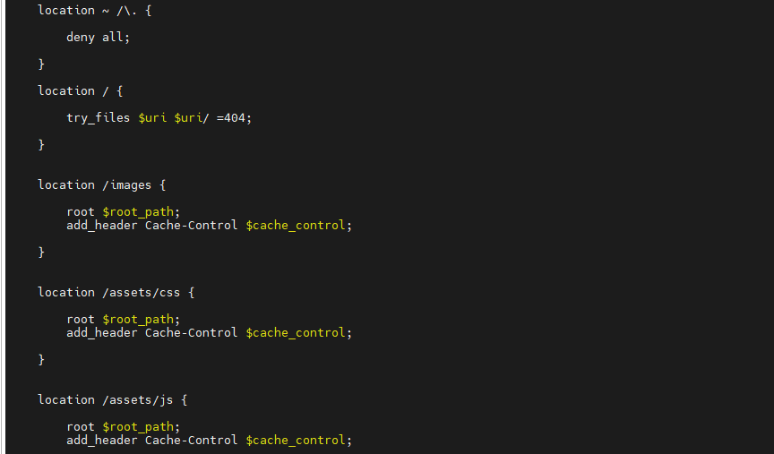
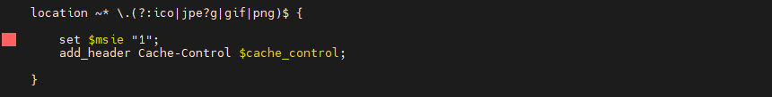
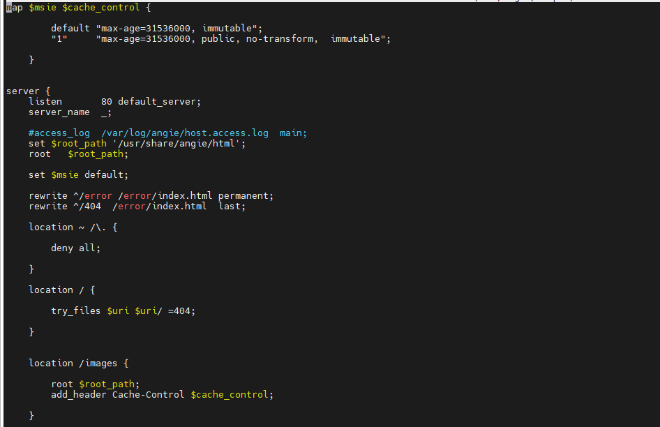
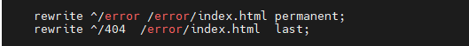
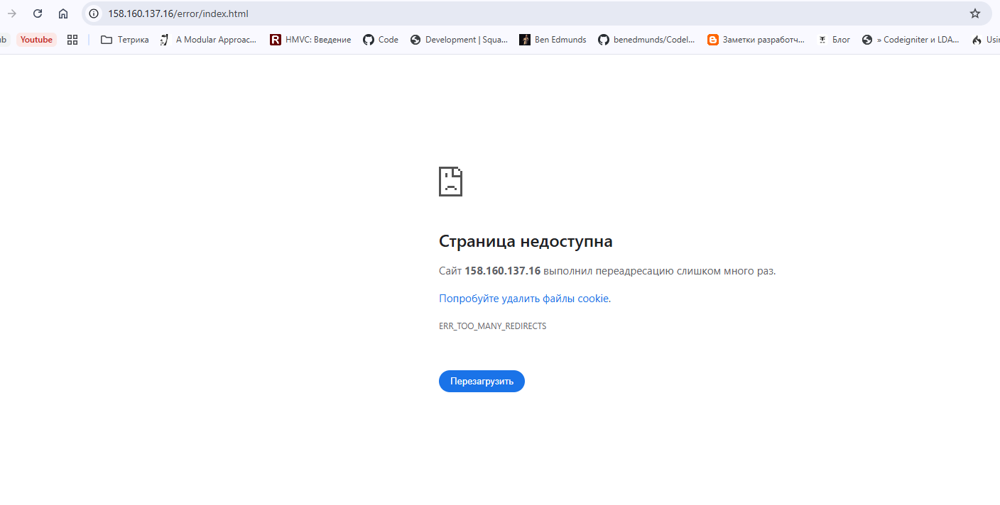
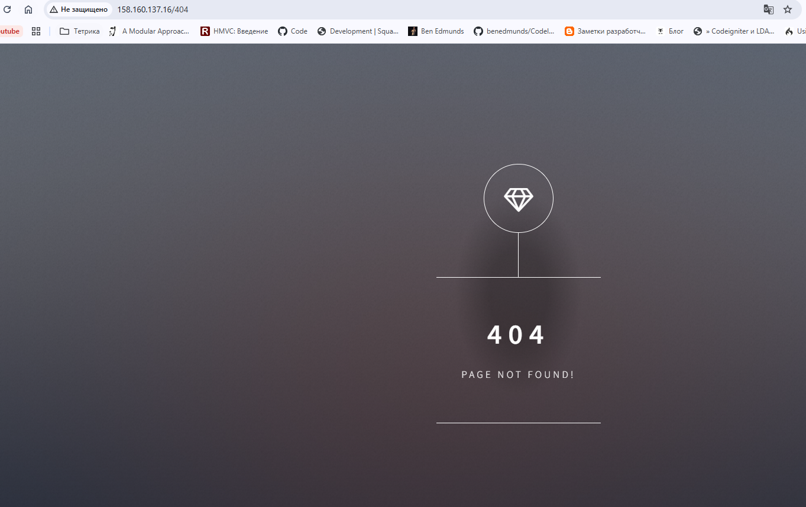
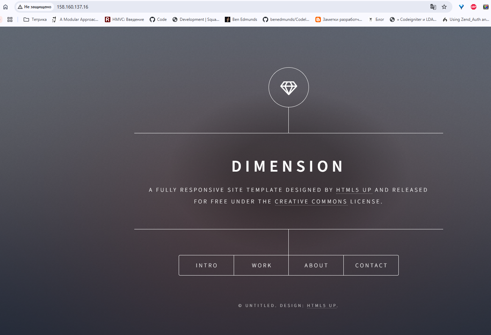

## Домашее задание № 3 Запуск статического сайта

### Занятие 5. Angie как веб-сервер // ДЗ

#### Цель

- создать базовую конфигурацию для работы статического сайта с разделением location.

#### Описание домашнего задания

Инструкция:

Запустите приложение из дополнительных материалов к занятию на сервере.
Для каждой директории создайте location со своими настройками. Отдельно создайте location с регулярным выражением для отдачи картинок jpg, jpeg, png, gif.
Задействуйте переменные, определённые с map для работы с location.
Настройте два вида перенаправлений (301/302 и внутренние).

#### Ход работы

1. Создали ВМ в Яндекс.Облако и развернули Angie

2. Разместили предоставленный статический сайт в соответсвующей директории

3. Настройка location для каждой диерктории. Для отдачи картинок создали location с регулярным выражением

4. С помощью директивы map определены переменные, которые исползуются в location

5. Настроены два вида перенаправления 301/302 и внутренние

Но перенаправление permanent (301) не заработало. Ошибка - много редиерктов. Не разобрался в связи с чем.

Внутреннее перенапралвение работает

#### Результат

Создали базовую конфигурацию для работы статического сайта с разделением location.

