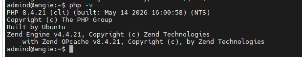
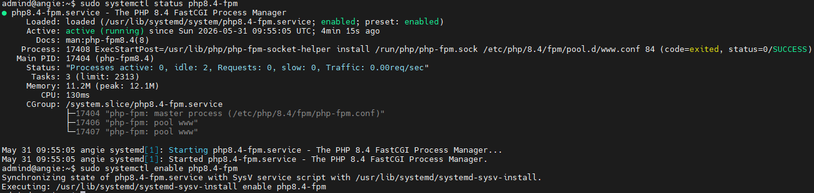
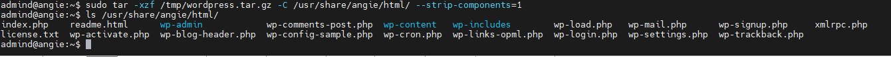
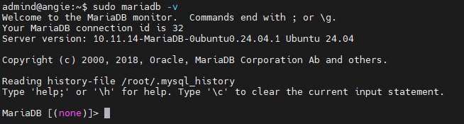
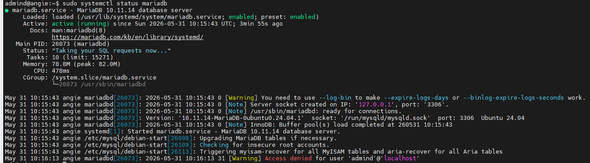
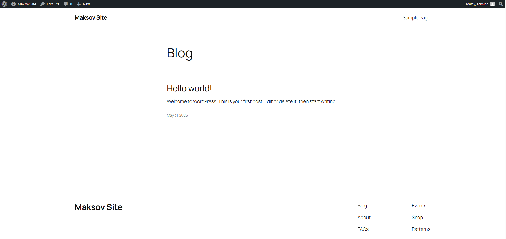

## Домашее задание № 4 Запуск сайта с CMS WordPress

### Занятие 6. Обратный прокси (reverse proxy) // ДЗ

#### Цель

- настроить Angie/Nginx как обратный прокси с разделением статических и динамических запросов для эксплуатации веб-приложения.

#### Описание домашнего задания

Инструкция:

Развернуть на вашей учебной виртуальной машине копию CMS WordPress или аналогичное веб-приложение с использованием стандартного дистрибутива или Docker-контейнера.
Настроить Angie в качестве обратного прокси для бэкенда.
Разделить обработку статических и динамических запросов.


#### Ход работы

1. Создали ВМ в Яндекс.Облако и развернули Angie

2. Установка php-fpm 8.3 с расширениями

```
sudo apt install software-properties-common ca-certificates apt-transport-https -y
sudo add-apt-repository ppa:ondrej/php
sudo apt update
```

```
sudo apt install php8.3 php8.3-fpm php8.3-cli php8.3-mysql php8.3-curl \
php8.3-xml php8.3-mbstring php8.3-zip php8.3-bcmath php8.3-intl -y
```


```
php -v
```
На скриншоте php8.4, т.к. потом поставил php8.3. Экспериментировал в результате ошибки


3. Запуск php-fpm

```
sudo systemctl status php8.3-fpm
sudo systemctl enable php8.3-fpm
sudo systemctl start php8.3-fpm
```



4. Разместили портал Wordpress в соответсвующей директории




5. Установка и настройка СУБД MariaDB для Wordpres

```
sudo apt install mariadb-server -y
```





Проведем базовую настройку безопасности СУБД

```
sudo mysql_secure_installation
```

Создадим пользователя для WordPress через MariaDB-консоль. 

```
CREATE DATABASE wp_db CHARACTER SET utf8mb4 COLLATE utf8mb4_unicode_ci;
CREATE USER 'wp_user'@'localhost' IDENTIFIED BY 'пароль';
GRANT SELECT, INSERT, UPDATE, DELETE, CREATE, ALTER, INDEX, DROP ON wp_db.* TO  'wp_user'@'localhost';
FLUSH PRIVILEGES; 
exit  
```

6. Настройка конфигурации Angie

Для работоспособности Angie с PHP-FPM был изменен пользователь, от которого запускается Angie, на www-data. Иначе возникала ошибка 502. А по логам была:
```
2026/05/31 11:19:04 [crit] 63879#63879: *1 connect() to unix:/run/php/php8.3-fpm.sock failed (13: Permission denied) while connecting to upstream, client: 95.172.121.246, server: _, request: "GET / HTTP/1.1", upstream: "fastcgi://unix:/run/php/php8.3-fpm.sock:", host: "81.26.187.70"
2026/05/31 11:19:06 [crit] 63879#63879: *1 connect() to unix:/run/php/php8.3-fpm.sock failed (13: Permission denied) while connecting to upstream, client: 95.172.121.246, server: _, request: "GET / HTTP/1.1", upstream: "fastcgi://unix:/run/php/php8.3-fpm.sock:", host: "81.26.187.70"
2026/05/31 11:19:07 [crit] 63879#63879: *1 connect() to unix:/run/php/php8.3-fpm.sock failed (13: Permission denied) while connecting to upstream, client: 95.172.121.246, server: _, request: "GET / HTTP/1.1", upstream: "fastcgi://unix:/run/php/php8.3-fpm.sock:", host: "81.26.187.70"
```

Полная кофигурация прилагается (angie-full.conf).

7. Настройка Wordpress

В процессе настройки введены данные подклюения к СУБД. Сформирован сайт wp-config.php

#### Результат

Настроен Angie как обратный прокси с разделением статических и динамических запросов для эксплуатации веб-приложения Wordpress.





