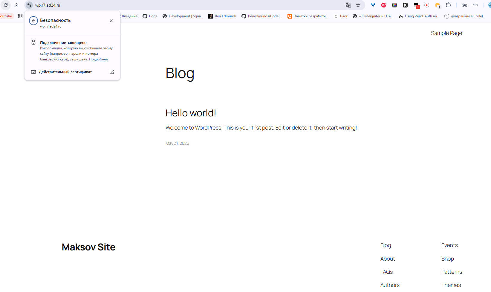
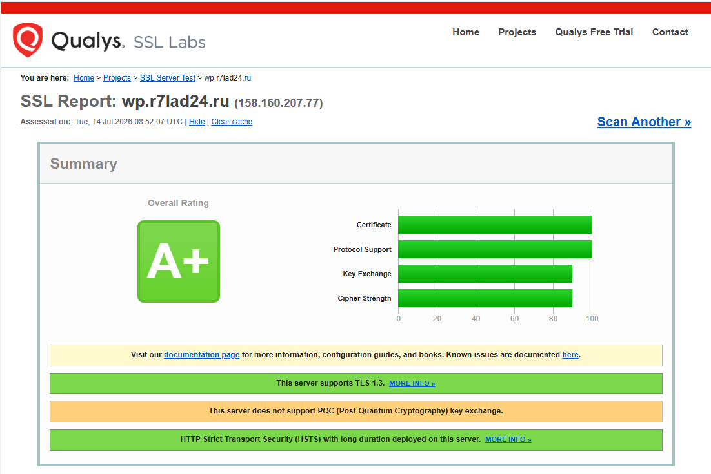
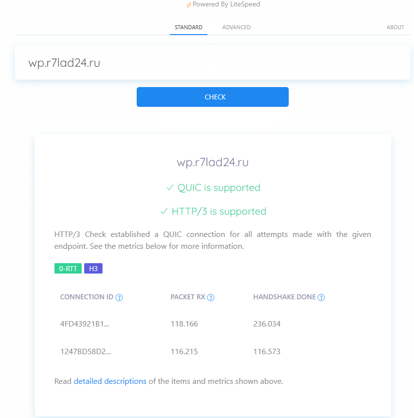

## Домашее задание № 6 Настройка HTTPS

### Занятие 14. Настройка HTTPS для веб-сервисов // ДЗ

#### Цель

- настроить эффективную и безопасную конфигурацию для HTTPS.

#### Описание домашнего задания

Инструкция:


Получите сертификат Let's Encrypt или создайте самоподписной. Используйте домен при наличии.
Настройте основные параметры HTTPS в Angie.
Оптимизируйте восстановление сессий.
Включите автоматическую переадресацию с HTTP на HTTPS.
Настройте заголовок HSTS.
Включите протоколы HTTP/2 и HTTP/3.
Проведите тестирование корректности конфигурации с помощью внешнего сервиса.


#### Ход работы

1. Создали ВМ в Яндекс.Облако и развернули Angie

2. С помощью Яндекс получили сертификат Let's Encrypt для домена *.r7lad24.ru. Для сайта используется домен wp.r7lad24.ru

3. Настройка основных параметров HTTPS в Angie

```
# Безопасные шифры и протоколы (TLSv1.3 обязателен для HTTP/3)
    ssl_protocols TLSv1.2 TLSv1.3;
    ssl_ciphers ECDHE-ECDSA-AES128-GCM-SHA256:ECDHE-RSA-AES128-GCM-SHA256:ECDHE-ECDSA-AES256-GCM-SHA384:ECDHE-RSA-AES256-GCM-SHA384:DHE-RSA-AES128-GCM-SHA256:DHE-RSA-AES256-GCM-SHA384;
    ssl_prefer_server_ciphers off;
server {
        # HTTP/2 и HTTP/3 (QUIC)
        listen 443 ssl; 
        listen [::]:443 ssl;
        listen 443 quic reuseport; 
        listen [::]:443 quic reuseport;
 # SSL-сертификаты (замените на свои пути)
        ssl_certificate /etc/ssl/r7lad24.ru.crt;
        ssl_certificate_key /etc/ssl/r7lad24.ru.key;
}
```
4. Оптимизиция восстановления сессий.
```
# Оптимизация TLS-сессий (Shared кэш на 10 МБ ~ 40 000 сессий)
    ssl_session_cache shared:SSL:10m;
    ssl_session_timeout 1d;
    ssl_session_tickets off; # Отключаем тикеты для идеальной Forward Secrecy
```
5. Автоматическая переадресация с HTTP на HTTPS.

```
# 1. Автоматический редирект с HTTP на HTTPS
    server {
        listen 80 default_server;
        listen [::]:80 default_server;
        server_name example.com ://example.com;

        return 301 https://$host$request_uri;
    }
```

6. Настройка заголовка HSTS.

```
# 3. Заголовок HSTS (Включен на 1 год, включая поддомены и preloading)
        add_header Strict-Transport-Security "max-age=31536000; includeSubDomains; preload" always
```

7. Протоколы HTTP/2 и HTTP/3.

```
# HTTP/2 и HTTP/3 (QUIC)
        listen 443 ssl; 
        listen [::]:443 ssl;
        listen 443 quic reuseport; 
        listen [::]:443 quic reuseport;
# 4. Объявление поддержки HTTP/3 для браузеров (Alt-Svc)
        add_header Alt-Svc 'h3=":443"; ma=86400' always;

```

Полный конфиг в файле angie-full.conf

#### Результат

Получен сертификат Let's Encrypt. Настроены основные параметры HTTPS в Angie.
Оптимизировано восстановление сессий. Включена автоматическая переадресация с HTTP на HTTPS. Настроен заголовок HSTS. Включены протоколы HTTP/2 и HTTP/3.



Проверка сайта на портале SSL LABs



Проверка сайта на портале http3check


