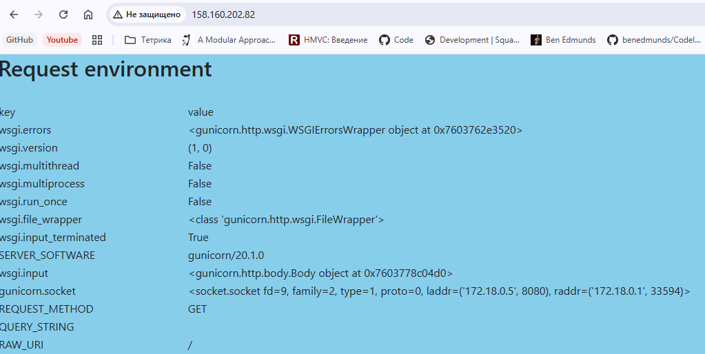
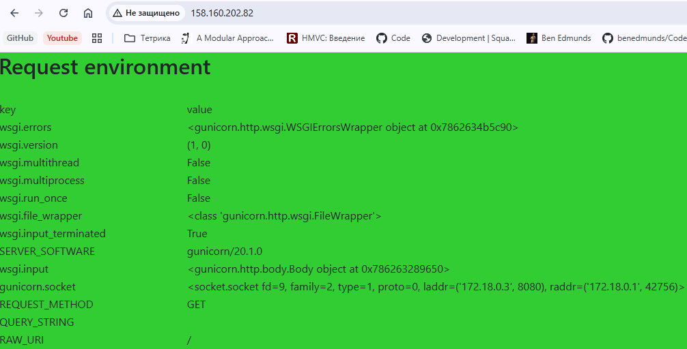
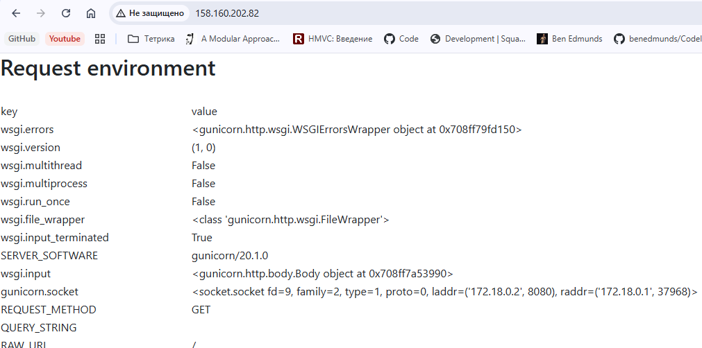

## Домашее задание № 7 Балансировка HTTP

### Занятие 16. Балансировка нагрузки (HTTP) // ДЗ 

#### Цель

- настроить эффективную и безопасную конфигурацию для HTTPS.настроить схему балансировки на уровне HTTP.

#### Описание домашнего задания

Инструкция:

Создайте несколько копий бэкендов.

Настройте балансировку по следующим вариантам:

Равномерная балансировка (round-robin).
Балансировка по хэшу с использованием переменных (на выбор).
Произвольная балансировка (random).

Покажите варианты конфигурации с резервным бэкендом и с отключением одного из бэкендов.
Протестируйте корректность настроенных схем.


#### Ход работы

1. Создали ВМ в Яндекс.Облако и развернули Angie

2. Установили docker

3. Запустили 4 экземпляра бэкенда webdebuger с разным фоном

4. Настроили angie с балансировкой RoundRobin на бэкенд.

```
upstream backend {
    zone upstream-backend 10m;
    server 127.0.0.1:9000;
    server 127.0.0.1:9001;
    server 127.0.0.1:9002;
    server 127.0.0.1:9003;
}

server {
    listen       80;
    server_name  _;

    #access_log  /var/log/angie/host.access.log  main;
    status_zone balance;
    location / {
        proxy_pass http://backend;

    }
}

```

5. Настройка балансировки по хэшу с выбором переменных

```
upstream backend {
    zone upstream-backend 10m;
    hash $scheme$request_uri;
    server 127.0.0.1:9000;
    server 127.0.0.1:9001;
    server 127.0.0.1:9002;
    server 127.0.0.1:9003;
}

server {
    listen       80;
    server_name  _;

    #access_log  /var/log/angie/host.access.log  main;
    status_zone balance;
    location / {
        proxy_pass http://backend;

    }
}

```

6. Настройка балансировки random
```
upstream backend {
    zone upstream-backend 10m;
    random;
    server 127.0.0.1:9000;
    server 127.0.0.1:9001;
    server 127.0.0.1:9002;
    server 127.0.0.1:9003;
}

server {
    listen       80;
    server_name  _;

    #access_log  /var/log/angie/host.access.log  main;
    status_zone balance;
    location / {
        proxy_pass http://backend;

    }
}

```

7. Конфигурация с резервным бэкендом и с отключением одного из бэкендов

```
upstream backend {
    zone upstream-backend 10m;
    server 127.0.0.1:9000 backup;
    server 127.0.0.1:9001;
    server 127.0.0.1:9002 down;
    server 127.0.0.1:9003;
}

server {
    listen       80;
    server_name  _;

    #access_log  /var/log/angie/host.access.log  main;
    status_zone balance;
    location / {
        proxy_pass http://backend;

    }
}

```

#### Результат

1. При RR поочередно меняется сервер бэкенда





2. При балансировке HASH с выбором переменных и балансировке random аналогчино происходит смена бэкенда в зависимости от алгоритма

3. Проверим схему с резервным бэкендом и отключением

```
upstream backend {
    zone upstream-backend 10m;
    server 127.0.0.1:9000 backup; //white
    server 127.0.0.1:9001;  //skyblue
    server 127.0.0.1:9002 down;  //limegreen
    server 127.0.0.1:9003;  //gold
}

```

В конфигурации работют бэкенды skyblue и gold.

Остановим эти бэкенды.

По результату начинает работать резервный бэкенд white.

